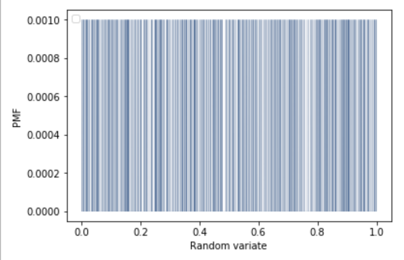
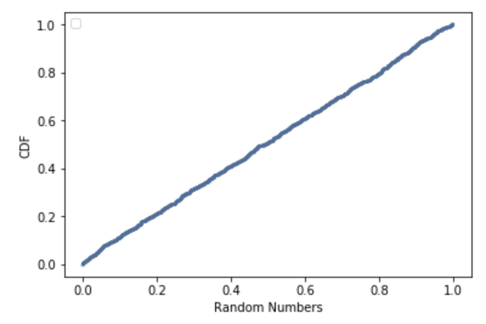

[Think Stats Chapter 4 Exercise 2](http://greenteapress.com/thinkstats2/html/thinkstats2005.html#toc41) (a random distribution)

>> SOLUTION

```python
# Get random numbers
sample = np.random.random(1000)

# Get PMF and plot
pmf = thinkstats2.Pmf(sample)
thinkplot.Pmf(pmf, linewidth=0.1)
thinkplot.Config(xlabel='Random variate', ylabel='PMF')
```


```python
# Get CDF and plot
cdf = thinkstats2.Cdf(sample)
thinkplot.Cdf(cdf)
thinkplot.Config(xlabel='Random Numbers', ylabel='CDF')
```


