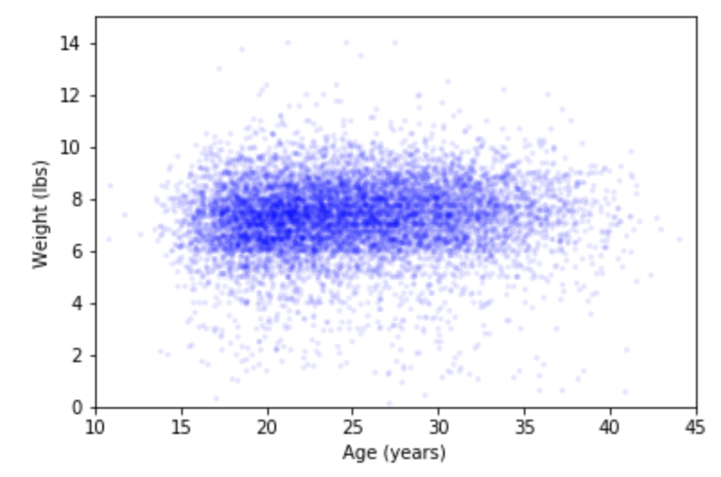
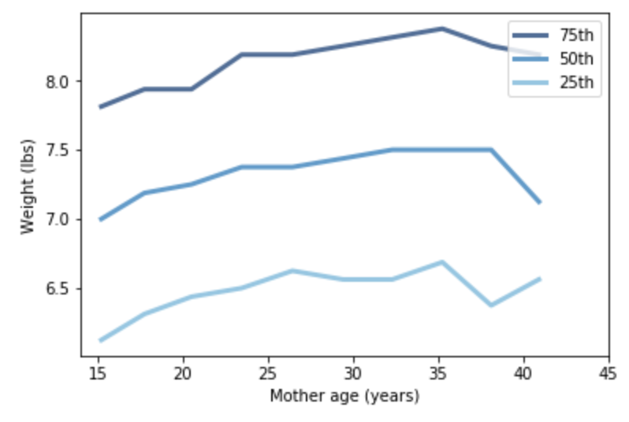

[Think Stats Chapter 7 Exercise 1](http://greenteapress.com/thinkstats2/html/thinkstats2008.html#toc70) (weight vs. age)

>> SOLUTION

```python
# Import Data
import first

live, firsts, others = first.MakeFrames()
live = live.dropna(subset=['agepreg', 'totalwgt_lb'])

# Find Correlations
ages = live.agepreg
weights = live.totalwgt_lb
print('Correlation:', Corr(ages, weights))
print('Spearman Correlation:', SpearmanCorr(ages, weights))
```
>> Output: 
Correlation: 0.06883397035410908
Spearman Correlation: 0.09461004109658226

```python
# Scatterplot
thinkplot.Scatter(ages, weights, alpha=0.1, s=10)
thinkplot.Config(xlabel='Age (years)',
                 ylabel='Weight (lbs)',
                 axis=[10, 45, 0, 15],
                 legend=False)
```


```python
# Percentile Graph
# create bins
bins = np.arange(10, 48, 3)
indices = np.digitize(live.agepreg, bins)
groups = live.groupby(indices)

# Compute CDF
ages = [group.agepreg.mean() for i, group in groups][1:-1]
cdfs = [thinkstats2.Cdf(group.totalwgt_lb) for i, group in groups][1:-1]

# Create plot with 3 lines
thinkplot.PrePlot(3)

# Create Percentiles
for percent in [75, 50, 25]:
    weights = [cdf.Percentile(percent) for cdf in cdfs]
    label = '%dth' % percent
    thinkplot.Plot(ages, weights, label=label)
    
thinkplot.Config(xlabel='Mother age (years)' ,
                 ylabel='Weight (lbs)',
                 xlim=[14,45], legend=True)
```



The scatterplot shows that there is a weak relationship between the variables. In addition, the correlations that we computed support this finding. The Pearson's coefficient is around 0.07 and Spearman's coefficient is 0.09. When we take the different between the two, it seems to suggest that there are influences from the outliers or a non-linear relationship.

When plotting the percentile, we can see that the relationship is non-linear. The birth weight increases more quickly in the range of mother's age from 15 to 25. After that, the effect is weaker.
