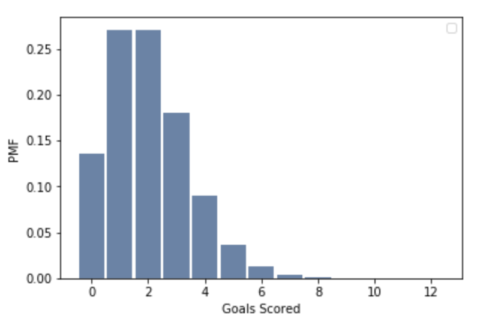

[Think Stats Chapter 8 Exercise 3](http://greenteapress.com/thinkstats2/html/thinkstats2009.html#toc77)

---

>> SOLUTION

```python
# Game Simulating function
def SimulateGame(lam):
    goals = 0
    t = 0
    while True:
        time_between_goals = random.expovariate(lam)
        t += time_between_goals
        if t > 1:
            break
        goals += 1

    # estimated goal-scoring rate is the actual number of goals scored
    L = goals
    return L

# Simulate multiple games
def SimulateMany(lam=2, m=1000000):
    estimates = []
    for i in range(m):
        L = SimulateGame(lam)
        estimates.append(L)
    
    print('RMSE goals:', RMSE(estimates, lam))
    print('Mean Error goals:', MeanError(estimates, lam))
    
    pmf = thinkstats2.Pmf(estimates)
    thinkplot.Hist(pmf)
    thinkplot.Config(xlabel="Goals Scored",
                    ylabel='PMF')

SimulateMany()
```

### Output
RMSE goals: 1.4151162496417033

Mean Error goals: 0.001582



## Conclusion
The RMSE found from the above was 1.4. In addition, the mean error decreases with m, meaning that this estimator is unbiased. 
